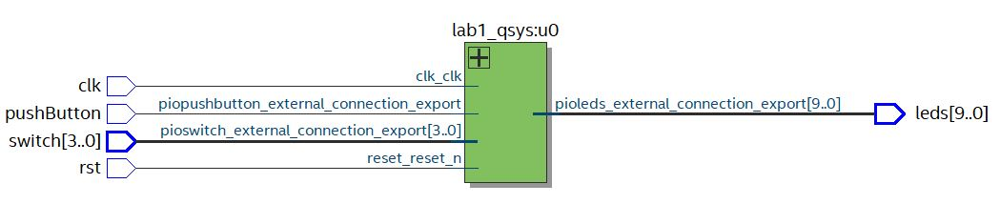

# FAUGERE_Lab1

Ce programme implémente un chenillard sur carte de10-lite.

## FONCTIONNEMENT

--------------------

Bouton KEY0 : RESET
Bouton KEY1 : démarre/stop le chenillard
Switch 3-0 : paramètre la vitesse du chenillard (valeur max "1111" = vitesse la plus faible / valeur min "0000" = vitesse la plus grande)
(il faut relancer le chenillard lors d'une modification de la vitesse)

---------------------

## DESIGN 
 
-------------------------

Gestion du temps : timer IP
Gestion des entrées/sorties : PIO (leds/boutons/switch)

Gestion de l'affichage du chenillard en C sur processeur NIOS II

--------------------------

